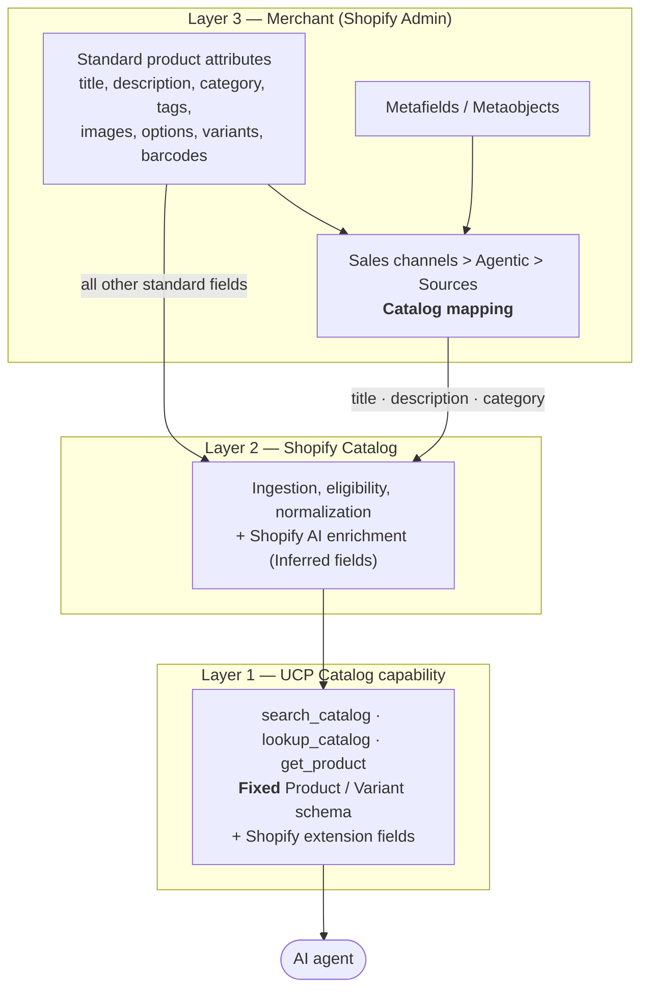
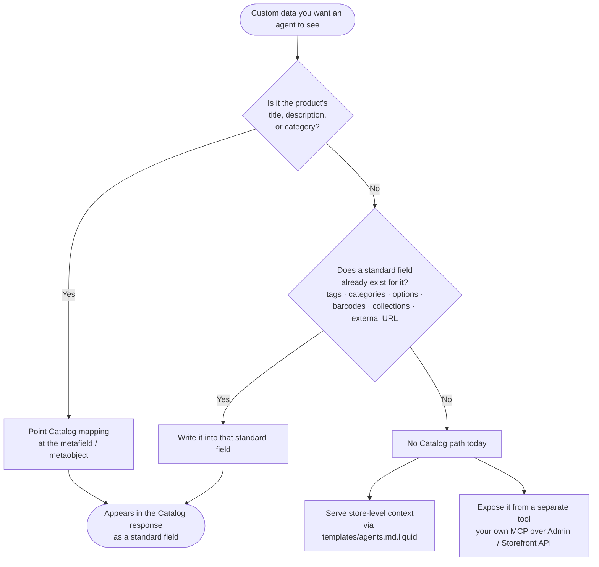
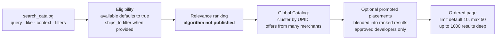

# Shopify Catalog Field Mapping & Data Sources

How merchant product data becomes a UCP Catalog response, how far custom data can travel, how keyword search results are ordered, and which parts of all this Shopify publishes.

Everything below comes from public sources (ucp.dev, shopify.dev, help.shopify.com, community.shopify.dev). Links are collected in [References](#references).

> **Verified:** 2026-09-08 · **UCP version:** `2026-08-25`
> Parts of this area (promoted placements) are in Developer Preview, and Shopify states that endpoint URLs and field shapes can change. Re-check the linked pages before relying on a detail.

---

## 1. The three layers

A Catalog field is never "just a product field". Three layers decide what an agent finally sees.

| Layer | Who controls it | What can change |
|---|---|---|
| 1. UCP schema | The protocol (ucp.dev) | Core tool and entity shapes are fixed. Additional data must use a declared extension or an existing custom-data slot. |
| 2. Shopify extensions + enrichment | Shopify | Extension fields are documented and fixed; inferred fields are generated by Shopify's AI. |
| 3. Merchant mapping | The merchant | Which source populates `title`, `description`, `category`, plus custom variant grouping. |

The practical consequence: **mapping re-points an existing field at a different source. It never adds a field.**

---

## 2. Layer 1 — the UCP Product and Variant schema

Shopify's Global Catalog MCP and Storefront Catalog MCP both implement the UCP Catalog capability (`dev.ucp.shopping.catalog.search`, `dev.ucp.shopping.catalog.lookup`), so the entity shape is the spec's.

### Product

| Field | Requirement | Description |
|---|---|---|
| `id` | Required | Global ID (GID) for the product |
| `title` | Required | Product title |
| `description` | Required | Product description, one or more formats |
| `price_range` | Required | Price range across all variants |
| `variants` | Required | Purchasable variants; first item is the featured variant |
| `handle`, `url` | Optional | URL-safe slug, canonical product URL |
| `categories` | Optional | Categories with optional taxonomy identifiers |
| `list_price_range` | Optional | Pre-discount range for strikethrough display |
| `media` | Optional | Images, video, 3D; first item is the featured media |
| `options` | Optional | Product options such as Size and Color |
| `rating` | Optional | Aggregate rating: `value`, `scale_min`, `scale_max`, `count` |
| `tags` | Optional | Tags for categorization and search |
| `metadata` | Optional | "Business-defined custom data extending the standard product model." Storefront Catalog does not populate this from merchant metafields; Global Catalog can add Shopify-inferred extension fields under `metadata`, see [§3](#3-layer-2--shopify-extension-fields) and [§5](#5-how-far-can-custom-metafields-travel). |

### Variant

| Field | Requirement | Description |
|---|---|---|
| `id` | Required | GID used as `item.id` at checkout |
| `title` | Required | Display title, for example `Blue / Large` |
| `description` | Required | Variant description |
| `price` | Required | Current selling price, per one `quantity_unit` |
| `sku`, `barcodes`, `handle`, `url` | Optional | Identifiers and URLs |
| `categories`, `options`, `tags` | Optional | Classification, selected options, tags |
| `quantity_unit` | Optional | Sale basis; default is `each`. Used for weight, length, time-based selling |
| `list_price`, `unit_price` | Optional | Pre-discount price, per-unit comparison price |
| `availability` | Optional | Availability for purchase |
| `rating`, `metadata` | Optional | Variant-level rating and custom-data slot |

---

## 3. Layer 2 — Shopify extension fields

| Extension | Name | Scope | Adds |
|---|---|---|---|
| Storefront Catalog | `dev.shopify.catalog` | One merchant store | `gift_card`, `collections`, `requires.shipping`, `requires.selling_plan`, `checkout_url`, `selling_plans`, plus the `available` filter |
| Global Catalog | `dev.shopify.catalog.global` | All Shopify merchants | `checkout_url`, `requires.shipping` / `requires.components`, `condition`, `eligible.native_checkout`, `availability.running_low`, `seller.id` / `seller.url` / `seller.domain`, similarity search via `like`, and the filters below |

Global Catalog filters: `available`, `condition`, `ships_to`, `ships_from`, `shops`, `categories`, `attributes` (only `Color`, `Size`, `Target gender`), `rating`, `price_tier`.

### Inferred fields (Global Catalog)

These are generated or enriched by Shopify's AI. They may be absent, and accuracy varies with the underlying product data. They are **not merchant-authored source text**.

| Field | Description |
|---|---|
| `description` | Description generated or enriched by Shopify |
| `options` | Options normalized for discovery and variant selection |
| `metadata.attributes` | Attributes such as material, style, occasion |
| `metadata.tech_specs` | Technical specifications |
| `metadata.top_features` | Top product features |
| `metadata.unique_selling_points` | Unique selling propositions |
| `variants[].condition` | `new` / `secondhand` labels |

---

## 4. Layer 3 — Catalog mapping in Shopify Admin

From **Sales channels > Agentic > Sources**, a merchant reviews how product data is sent to Shopify Catalog and can re-point individual fields.

| Catalog field | Default source | Alternative source | Notes |
|---|---|---|---|
| Product title | Product title attribute | Another source selected from the **Product title** dropdown | For merchants who keep the canonical title in custom data |
| Product description | Product description attribute | Another source selected from the **Product description** dropdown | Same pattern |
| Product category | Product category attribute | Another source selected from the **Product category** dropdown | Same pattern |
| Variant grouping | Shopify default grouping | Custom variant grouping, then pick a grouping method | Controls how variants are grouped into one Catalog listing |

Everything else — tags, images, barcodes, options, variants, collections, price, availability — flows from the standard product model with no per-field switch.

### What AI channels weigh when matching a query to a product

Shopify's optimization guidance lists the product details AI platforms and shopping sites consider:

| Signal | Notes |
|---|---|
| Title | Clear, accurate, specific |
| Description | Detailed enough for the agent to match intent |
| Images | Real product imagery |
| Product organization | Type, Vendor, Collections, Tags |
| Barcode | ISBN, UPC, GTIN and similar |
| Variants | Including option names |
| External product URL | Required on the Shopify Agentic plan, set through the External URL standard metafield |

---

## 5. How far can custom metafields travel?

**Short answer: an arbitrary metafield cannot appear in a Catalog response.** It can only be poured into a field that already exists.

| Question | Answer | Source |
|---|---|---|
| Does UCP `metadata` carry my product metafields? | **No.** Shopify does not populate the product `metadata` field in Storefront Catalog MCP responses, whether or not Storefront API access is enabled on the metafield definition. | Shopify staff answer, 2026-09-08 |
| Are `metadata.*` fields in the Global Catalog extension merchant-authored? | **No.** They are Shopify-inferred enrichment. | Global Catalog extension docs; same staff answer |
| Can I add custom product fields or custom checkout logic to the MCP tools? | **No.** The UCP catalog and checkout tools use a fixed, standardized schema with no extension point. | Shopify staff answer, 2026-08-19 |
| Are metafields searchable through the MCP tools? | **No.** Metafields are not supported, so metafield values do not match a keyword query. Logged as a feature request. | Community thread, 2025-11 to 2026-01 |
| Is there any supported route? | **Yes, two.** Catalog mapping for title / description / category, and standard fields that already exist for the data. | Help Center mapping page |

---

## 6. Keyword search result ordering

What is documented is the *shape* of the ordering and the inputs that influence it. The ranking algorithm and its weights are not published.

| Documented behaviour | Detail |
|---|---|
| No sort parameter | The request accepts `query`, `like`, `context`, `filters`, `view`, `pagination`. There is no sort key; order is the server's relevance. |
| Buyer context influences relevance | `context` carries `address_country`, `address_region`, `postal_code`, `language`, `currency`, `intent`. UCP treats context as provisional: a Business may ignore or down-rank it against higher-confidence signals. |
| First element is the best match | UCP: `media` and `variants` are ordered arrays; the Business returns the most relevant variant and image first, and the Platform treats the first element as featured. |
| Availability and destination gate the results | `filters.available` defaults to `true`. Use `filters.ships_to` for explicit destination filtering; `context.address_country` is a relevance and localization signal, not a documented strict shipping filter. Pass the country explicitly instead of relying on an implicit default. |
| Global results are clustered by UPID | One product row can carry offers from multiple merchants. |
| Paid placements can be blended in | With an affiliate-enabled saved catalog passed as `catalog.catalog_id`, Shopify blends promoted placements into the ranked results. Promoted variants carry a `placement` object; organic variants do not. Unapproved callers get organic results plus a `messages` note. Developer Preview. |
| Pagination is bounded | `limit` defaults to 10 and maxes at 50; depth is capped at 1,000 results; `total_count` is an **estimate**, not an exact count. |

Not published: ranking weights, per-signal scoring, why one merchant outranks another, and whether a specific store is syndicated to a given AI channel.

---

## 7. What is public, and where

| Area | Status | Where |
|---|---|---|
| UCP protocol: Catalog capability, Product / Variant / Rating entities, MCP binding | Public | ucp.dev |
| Shopify implementation: Global and Storefront Catalog MCP tools, every request parameter, response examples | Public | shopify.dev/docs/agents |
| Shopify extension field lists and inferred-field lists | Public | shopify.dev/docs/agents/catalog/*-extension |
| Saved Catalogs, promoted placements, commission and disclosure rules | Public (Developer Preview, subject to change) | shopify.dev/docs/agents/catalog |
| Merchant operations: Catalog requirements, field mapping, AI optimization, agentic storefront settings, data sharing | Public | help.shopify.com |
| Search ranking algorithm, weights, scores | **Not published** | — |
| How inferred fields are generated, and their accuracy | **Not published** (only the caveat that they may be absent and vary) | — |
| Syndication state to a specific AI channel, for example ChatGPT Shopping | **Not published** (individual store sync state is not disclosed in the forums) | — |
| Roadmap for metafield support in `metadata` | **Not published** (answers stop at "logged as a feature request") | — |

Constraints the docs state explicitly and that belong in any integration review: search results must not be cached, product images must be rendered in real time rather than stored, Catalog queries are rate limited with no increase available for keyless access, and endpoint URLs may change.

---

## 8. Can an app extend the Catalog response?

**No, not the response schema.** Public statements are consistent:

| Route | Status |
|---|---|
| Add custom product fields to the MCP tools | Not possible — fixed, standardized schema, no extension point (Shopify staff, 2026-08-19) |
| Have an installed app append fields or capabilities to the merchant's `/.well-known/ucp` profile | Not possible today. Shopify calls it a known gap and is aware of the fulfillment and product-options use cases (Shopify staff, 2026-08-21) |
| Push app data into UCP `metadata` | Not possible — Shopify does not populate it from metafields (Shopify staff, 2026-09-08) |

### The ratings example

Ratings are the usual "surely an app can add this" case, so it is worth separating three facts:

1. **The response has a rating slot.** Product and Variant carry `rating` with `value`, `scale_min`, `scale_max`, `count`, and Global Catalog search accepts `filters.rating.variant.min` and `filters.rating.variant.min_count`. Documented examples show `"rating": {"value": 4.5, "scale_max": 5, "count": 120}`.
2. **Shopify defines exactly one place for review data.** Review apps are required to syndicate reviews to the standard `product_review` metaobject and to write aggregates to the `reviews.rating` and `reviews.rating_count` standard metafields, which are not merchant-editable and are only reachable through the GraphQL Admin API. Shop product reviews can also sync from partner apps such as Judge.me, Loox, Okendo, Stamped.io and Yotpo.
3. **No public document states that the Catalog `rating` field is fed from those metafields.** So "install a review app and ratings show up in Catalog" is not a claim public docs support. Verify per store by calling `search_catalog` or `get_product` and checking whether `rating` is returned.

The general shape holds: an app fills a standard slot, it never adds one.

### Ways to give agents more context without new fields

| Route | What it does |
|---|---|
| `templates/agents.md.liquid` | `/agents.md` is the canonical agent-discovery document. `/llms.txt` and `/llms-full.txt` mirror it by default unless dedicated templates override them. Store-level context, not Catalog fields. |
| WebMCP | Tools on Liquid storefronts let an agent search the catalog and manage the cart in the shopper's live browser session, reaching real store content without custom UCP fields. |
| A separate MCP tool of your own | Serve the extra data from your own server over the Admin or Storefront API and expose it as an additional tool next to the Catalog tools. |

---

## References

### Protocol
- [UCP Catalog capability](https://ucp.dev/2026-08-25/specification/shopping/catalog/) — Product, Variant and Rating entities, ordering rules, context semantics
- [Universal Commerce Protocol](https://ucp.dev)

### Shopify developer docs
- [About Catalogs](https://shopify.dev/docs/agents/catalog) — the three tools, usage guidelines, Saved Catalogs
- [Global Catalog MCP](https://shopify.dev/docs/agents/catalog/global-catalog) — every request parameter, context, pagination
- [Global Catalog extension](https://shopify.dev/docs/agents/catalog/global-catalog-extension) — extension fields, filters, inferred fields
- [Storefront Catalog MCP](https://shopify.dev/docs/agents/catalog/storefront-catalog)
- [Storefront Catalog extension](https://shopify.dev/docs/agents/catalog/storefront-catalog-extension)
- [Earn with promoted placements](https://shopify.dev/docs/agents/catalog/promoted-placement)
- [Standard product review metaobject](https://shopify.dev/docs/apps/build/metaobjects/standard-review-metaobject) — `reviews.rating` and `reviews.rating_count` requirements
- [`agents.md.liquid` theme template](https://shopify.dev/docs/storefronts/themes/architecture/templates/agents-md-liquid)
- [WebMCP tools](https://shopify.dev/docs/api/web-mcp)

### Merchant documentation
- [Mapping your product data sources for Shopify Catalog](https://help.shopify.com/en/manual/shopify-catalog/mapping)
- [Optimizing your products for AI platforms](https://help.shopify.com/en/manual/shopify-catalog/optimizing-products)
- [Shopify Catalog](https://help.shopify.com/en/manual/shopify-catalog)
- [Shopify Catalog and product discovery for agentic storefronts](https://help.shopify.com/en/manual/online-sales-channels/agentic-storefronts/products)
- [Setting up agentic storefronts on the Agentic plan](https://help.shopify.com/en/manual/online-sales-channels/agentic-storefronts/agentic-plan-setup)
- [Syncing Shop product reviews with partner apps](https://help.shopify.com/en/manual/online-sales-channels/shop/product-reviews/sync-partner-apps)

### Shopify staff answers in the developer community
- [UCP catalog `metadata` field never populated by product metafields](https://community.shopify.dev/t/ucp-catalog-metadata-field-never-populated-by-product-metafields-expected-behavior-or-missing-feature/37487) — 2026-09-08
- [Custom UCP integration](https://community.shopify.dev/t/custom-ucp-integration/36233) — 2026-08-19
- [Can a third-party app extend the UCP profile at `/.well-known/ucp`?](https://community.shopify.dev/t/can-a-third-party-app-extend-the-ucp-profile-at-well-known-ucp/36329) — 2026-08-21
- [Metafields not being returned or searched](https://community.shopify.dev/t/metafields-not-being-returned-or-searched/25417)
- [llms.txt and agents.md](https://community.shopify.dev/t/llms-txt-and-agents-md/34049)

### Related documents in this repository
- [Tips & Best Practices](tips.md)
- [Sequence Diagram](sequence-diagram.md)
- [Testing with the UCP CLI](test-with-ucp-cli.md)
